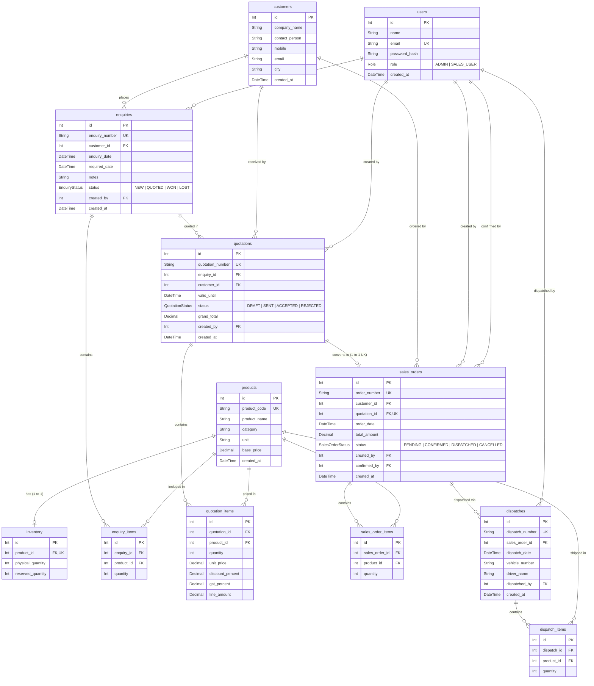

# Entity Relationship (ER) Diagram - PERN ERP

The diagram below represents the relational database schema defined in Prisma for the PERN ERP application.

```mermaid
erDiagram
    users {
        Int id PK
        String name
        String email UK
        String password_hash
        Role role "ADMIN | SALES_USER"
        DateTime created_at
    }

    customers {
        Int id PK
        String company_name
        String contact_person
        String mobile
        String email
        String city
        DateTime created_at
    }

    products {
        Int id PK
        String product_code UK
        String product_name
        String category
        String unit
        Decimal base_price
        DateTime created_at
    }

    inventory {
        Int id PK
        Int product_id FK, UK
        Int physical_quantity
        Int reserved_quantity
    }

    enquiries {
        Int id PK
        String enquiry_number UK
        Int customer_id FK
        DateTime enquiry_date
        DateTime required_date
        String notes
        EnquiryStatus status "NEW | QUOTED | WON | LOST"
        Int created_by FK
        DateTime created_at
    }

    enquiry_items {
        Int id PK
        Int enquiry_id FK
        Int product_id FK
        Int quantity
    }

    quotations {
        Int id PK
        String quotation_number UK
        Int enquiry_id FK
        Int customer_id FK
        DateTime valid_until
        QuotationStatus status "DRAFT | SENT | ACCEPTED | REJECTED"
        Decimal grand_total
        Int created_by FK
        DateTime created_at
    }

    quotation_items {
        Int id PK
        Int quotation_id FK
        Int product_id FK
        Int quantity
        Decimal unit_price
        Decimal discount_percent
        Decimal gst_percent
        Decimal line_amount
    }

    sales_orders {
        Int id PK
        String order_number UK
        Int customer_id FK
        Int quotation_id FK, UK
        DateTime order_date
        Decimal total_amount
        SalesOrderStatus status "PENDING | CONFIRMED | DISPATCHED | CANCELLED"
        Int created_by FK
        Int confirmed_by FK
        DateTime created_at
    }

    sales_order_items {
        Int id PK
        Int sales_order_id FK
        Int product_id FK
        Int quantity
    }

    dispatches {
        Int id PK
        String dispatch_number UK
        Int sales_order_id FK
        DateTime dispatch_date
        String vehicle_number
        String driver_name
        Int dispatched_by FK
        DateTime created_at
    }

    dispatch_items {
        Int id PK
        Int dispatch_id FK
        Int product_id FK
        Int quantity
    }

    products ||--o| inventory : "has (1-to-1)"
    customers ||--o{ enquiries : "places"
    users ||--o{ enquiries : "creates"
    enquiries ||--o{ enquiry_items : "contains"
    products ||--o{ enquiry_items : "included in"

    enquiries ||--o{ quotations : "quoted in"
    customers ||--o{ quotations : "received by"
    users ||--o{ quotations : "created by"
    quotations ||--o{ quotation_items : "contains"
    products ||--o{ quotation_items : "priced in"

    quotations ||--o| sales_orders : "converts to (1-to-1 UK)"
    customers ||--o{ sales_orders : "ordered by"
    users ||--o{ sales_orders : "created by"
    users ||--o{ sales_orders : "confirmed by"
    sales_orders ||--o{ sales_order_items : "contains"
    products ||--o{ sales_order_items : "reserved in"

    sales_orders ||--o{ dispatches : "dispatched via"
    users ||--o{ dispatches : "dispatched by"
    dispatches ||--o{ dispatch_items : "contains"
    products ||--o{ dispatch_items : "shipped in"
```
